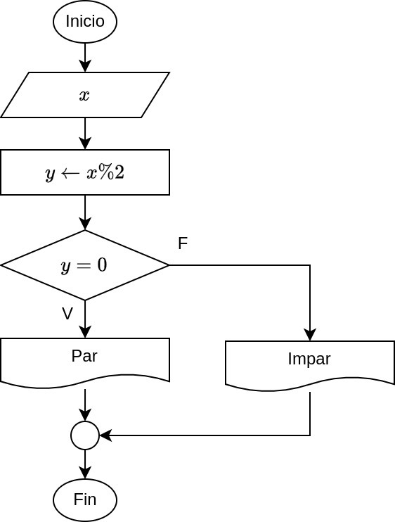
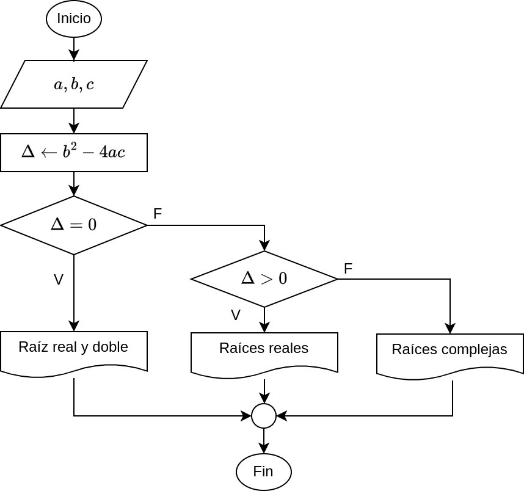
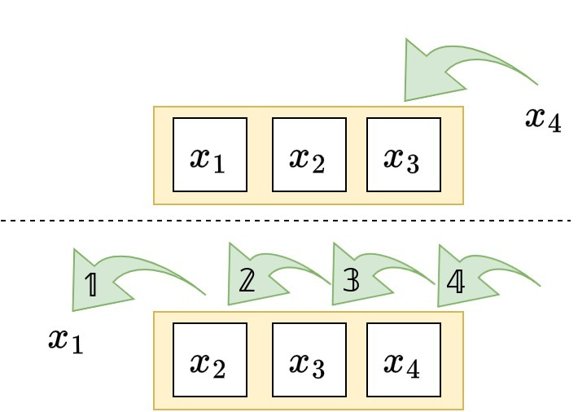
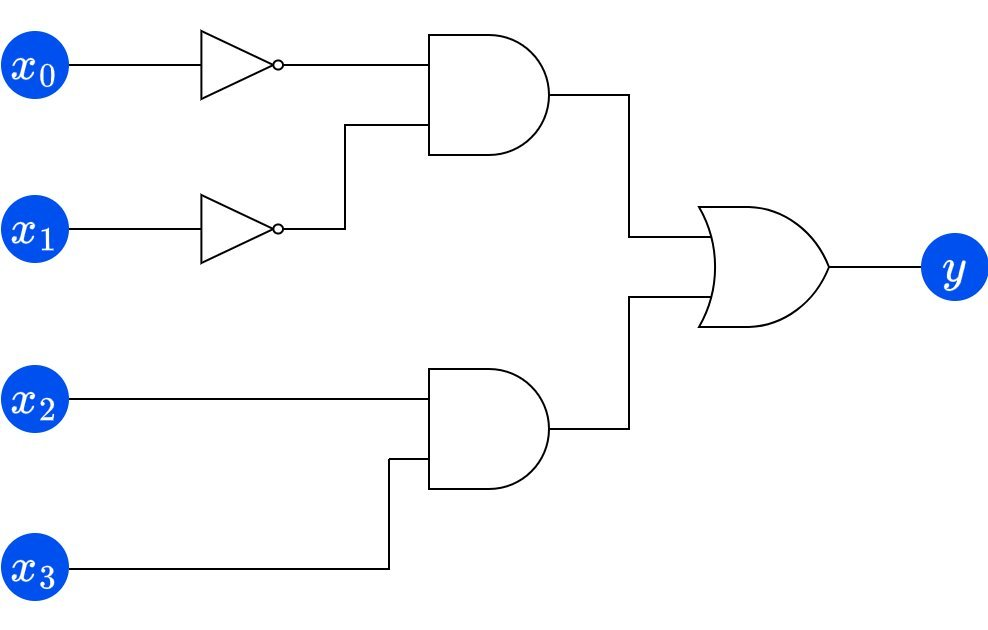
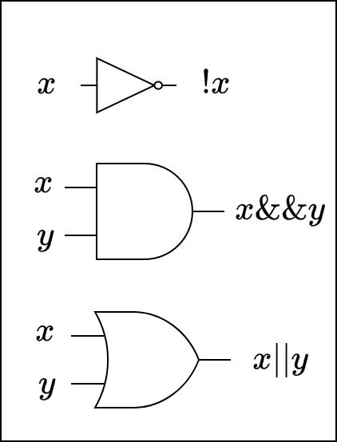

<div align="center">

# Semana 02. Estructuras de Control

**CS6003 - Programación 2**

Unidad 1. Introducción al diseño de algoritmos y programación en C++

Sesiones de laboratorio **2A** y **2B** — Universidad de Ingeniería y Tecnología (UTEC)

</div>

---

## Tabla de contenidos

- [Información del curso](#información-del-curso)
- [Objetivos](#objetivos)
- [Laboratorio 2A](#laboratorio-2a)
  - [Actividad 1. Leyendo diagramas](#actividad-1-leyendo-diagramas)
  - [Actividad 2. Bucles y gatos](#actividad-2-bucles-y-gatos)
  - [Actividad 3. Números primos](#actividad-3-números-primos)
  - [Más ejercicios 2A](#más-ejercicios-2a)
- [Laboratorio 2B](#laboratorio-2b)
  - [Actividad 1. Triángulos en consola](#actividad-1-triángulos-en-consola)
  - [Actividad 2. Código secreto](#actividad-2-código-secreto)
  - [Actividad 3. La vuelta al mundo](#actividad-3-la-vuelta-al-mundo)
  - [Actividad 4. Circuito digital](#actividad-4-circuito-digital)
  - [Más ejercicios 2B](#más-ejercicios-2b)
- [Conclusiones](#conclusiones)
- [Código fuente](#código-fuente)
- [Compilación y ejecución](#compilación-y-ejecución)
- [Estructura del repositorio](#estructura-del-repositorio)

---

## Información del curso

| Profesor | Correo |
| :--- | :--- |
| Augusto García | agarciar@utec.edu.pe |
| Carlos Palomino | cpalominov@utec.edu.pe |
| David Perez | dperezc@utec.edu.pe |
| Ian Brossard | ibrossard@utec.edu.pe |
| Jorge Buzzio | jbuzzio@utec.edu.pe |
| Jorge Fatama | jfatama@utec.edu.pe |
| Vittorino Mandujano | vmandujano@utec.edu.pe |
| Walter Quispe | wquispev@utec.edu.pe |
| Wilder Nina | wnina@utec.edu.pe |

> **Nota académica. Reconocimiento de autoría**
>
> Este material ha sido reestructurado, ampliado y transcrito en LaTeX por **Vittorino Mandujano Cornejo**
> para el ciclo actual, basándose en los contenidos desarrollados originalmente por
> **María Hilda Bermejo** y **José Fiestas** (laboratorio 2A) y por **María Hilda Bermejo** (laboratorio 2B).

## Objetivos

- Conocer y usar estructuras de control en C++.
- Reconocer una estructura selectiva de una estructura repetitiva.

---

<div align="center">

# Laboratorio 2A

</div>

**Contenido de la sesión**

1. Objetivos
2. Actividad 1. Leyendo diagramas
3. Actividad 2. Bucles y gatos
4. Actividad 3. Números primos
5. Más ejercicios
6. Conclusiones

---

## Actividad 1. Leyendo diagramas

En esta actividad vamos a leer diagramas de flujo y los vamos a implementar.

### Primer diagrama

> ¿Qué estructuras de control se están utilizando? ¿Qué hace el algoritmo?

<div align="center">
  
  <p><em>Figura 2. Primer diagrama.</em></p>
</div>

**Código:** [`Sesion_2A/01_diagrama_par_impar.cpp`](Sesion_2A/01_diagrama_par_impar.cpp)

```cpp
#include <iostream>
#include <string>
using namespace std;

int main() {
    int x, y;

    cout << "Ingrese un entero: ";
    cin >> x;
    y = x % 2;

    if (y == 0) {
        cout << "El número ingresado es PAR" << endl;
    } else {
        cout << "El número ingresado es IMPAR" << endl;
    }

    return 0;
}
```

### Segundo diagrama

> ¿Qué estructuras de control se están utilizando? ¿Qué hace el algoritmo?

<div align="center">
  
  <p><em>Figura 3. Siguiente diagrama.</em></p>
</div>

**Código:** [`Sesion_2A/02_diagrama_discriminante.cpp`](Sesion_2A/02_diagrama_discriminante.cpp)

```cpp
#include <iostream>
#include <string>
using namespace std;

int main() {
    float a, b, c, delta;

    cout << "Ingrese a: ";
    cin >> a;
    cout << "Ingrese b: ";
    cin >> b;
    cout << "Ingrese c: ";
    cin >> c;

    delta = b*b - 4*a*c;

    if (delta == 0) {
        cout << "Las raíces reales dobles";
    } else if (delta > 0) {
        cout << "Las raíces son reales";
    } else {
        cout << "Las raíces son complejas";
    }

    return 0;
}
```

---

## Actividad 2. Bucles y gatos

Este gato ha sido castigado a escribir en la pizarra `CS 6003 - Programación 2` varias veces.
Ayúdenlo a hacerlo con C++.

**Enunciado.** El programa debe recibir un número entero positivo correspondiente a la cantidad de veces.
La salida deben ser varias copias de `CS 6003 - Programación 2`.

Implemente **tres versiones**, una para cada sentencia repetitiva:

| Versión | Sentencia |
| :--- | :--- |
| 1 | `for` |
| 2 | `while` |
| 3 | `do-while` |

<details>
<summary><strong>Solución con for</strong></summary>

**Código:** [`Sesion_2A/03_bucles_gatos_for.cpp`](Sesion_2A/03_bucles_gatos_for.cpp)

```cpp
#include <iostream>
#include <string>
using namespace std;

int main() {
    int n = 1;
    cout << "Ingrese la cantidad de repeticiones: ";
    cin >> n;

    for (int i = 0; i < n; i++) {
        cout << "CS 6003 - Programación 2\n";
    }
    cout << endl;

    return 0;
}
```

</details>

<details>
<summary><strong>Solución con while</strong></summary>

**Código:** [`Sesion_2A/04_bucles_gatos_while.cpp`](Sesion_2A/04_bucles_gatos_while.cpp)

```cpp
#include <iostream>
#include <string>
using namespace std;

int main() {
    int n = 1;
    cout << "Ingrese la cantidad de repeticiones: ";
    cin >> n;

    while (n--) {
        cout << "CS 6003 - Programación 2\n";
    }
    cout << endl;

    return 0;
}
```

</details>

<details>
<summary><strong>Solución con do-while</strong></summary>

**Código:** [`Sesion_2A/05_bucles_gatos_do_while.cpp`](Sesion_2A/05_bucles_gatos_do_while.cpp)

```cpp
#include <iostream>
#include <string>
using namespace std;

int main() {
    int n = 1;
    cout << "Ingrese la cantidad de repeticiones: ";
    cin >> n;

    do {
        cout << "CS 6003 - Programación 2\n";
    } while (--n);
    cout << endl;

    return 0;
}
```

</details>

### Revisando las soluciones

- Revise las tres implementaciones y compare.
- ¿Qué implementación es más larga o tiene más líneas?
- ¿Qué significa `--n` y `n--`?
- ¿Por qué en los paréntesis de los `while` funciona sin una expresión booleana conocida?
- ¿Qué pasaría si accidentalmente se ingresa al programa un entero negativo?

---

## Actividad 3. Números primos

Implemente un programa que indique si un número entero mayor a 1 es primo o no.

**Código:** [`Sesion_2A/06_numeros_primos.cpp`](Sesion_2A/06_numeros_primos.cpp)

```cpp
#include <iostream>
#include <string>
using namespace std;

int main() {
    int n, m = 2;
    cout << "Ingrese un entero mayor a 1: ";
    cin >> n;

    while (n % m) {
        m++;
    }

    if (n == m) {
        cout << n << " es PRIMO";
    } else {
        cout << n << " no es primo";
    }

    cout << endl;

    return 0;
}
```

---

## Más ejercicios 2A

### Ejercicio 1. Hasta cero

Realice un programa que permita leer varios números enteros hasta que se introduzca el cero.
Luego el programa mostrará lo siguiente:

- La cantidad de números leídos.
- La cantidad de números pares.
- La cantidad de números impares.

El cero **no** debe entrar en el conteo.

### Ejercicio 2. Aproximando pi

El valor de pi puede ser aproximadamente la siguiente serie infinita:

```
pi = 3 + 4/(2x3x4) - 4/(4x5x6) + 4/(6x7x8) - 4/(8x9x10) + ...
```

Escriba un programa que muestre **60 aproximaciones** de pi. La primera aproximación debe usar solo el
primer término de la serie infinita, y cada aproximación debe incluir un nuevo término. Observando la
lista de aproximaciones podría deducir en qué aproximación se estabiliza el valor de pi.

### Ejercicio 3. Casillas de ajedrez

Implemente un programa donde se ingrese el nombre de una casilla del tablero de ajedrez y este devuelva
su color.

```text
Ingrese la columna: e
Ingrese la fila: 4
La casilla es blanca.
```

```text
8 0Z0Z0Z0Z
7 Z0Z0Z0Z0
6 0Z0Z0Z0Z
5 Z0Z0Z0Z0
4 0Z0Z0Z0Z
3 Z0Z0Z0Z0
2 0Z0Z0Z0Z
1 Z0Z0Z0Z0
  a b c d e f g h
```

---

<div align="center">

# Laboratorio 2B

</div>

**Contenido de la sesión**

1. Objetivos
2. Actividad 1. Triángulos en consola
3. Actividad 2. Código secreto
4. Actividad 3. La vuelta al mundo
5. Actividad 4. Circuito digital
6. Más ejercicios
7. Conclusiones

---

## Actividad 1. Triángulos en consola

Escriba un programa que permita leer un número entero positivo e imprima un triángulo con asteriscos
tal como en los siguientes ejemplos:

```text
Ingrese n: 5      Ingrese n: 7      Ingrese n: 4
*                 *                 *
**                **                **
***               ***               ***
****              ****              ****
*****             *****
                  ******
                  *******
```


**Código:** [`Sesion_2B/01_triangulo_asteriscos.cpp`](Sesion_2B/01_triangulo_asteriscos.cpp)

```cpp
#include <iostream>
#include <string>
using namespace std;

int main() {
    int n;
    cout << "Ingrese un número entero positivo: ";
    cin >> n;

    for (int i = 1; i <= n; i++) {
        for (int j = 0; j < i; j++) {
            cout << "*";
        }
        cout << endl;
    }

    return 0;
}
```

### Otros triángulos en consola

Ahora implemente una nueva versión donde los triángulos estén **a la derecha**.

```text
Ingrese n: 5          Ingrese n: 7          Ingrese n: 6
    *                       *                    *
   **                      **                   **
  ***                     ***                  ***
 ****                    ****                 ****
*****                   *****                *****
                       ******               ******
                      *******
```

### Últimos triángulos en consola

Por último, dibuje estos triángulos.

```text
Ingrese n: 5          Ingrese n: 7          Ingrese n: 6
    *                       *                    *
   ***                     ***                  ***
  *****                   *****                *****
 *******                 *******              *******
*********               *********            *********
                       ***********          ***********
                      *************
```

---

## Actividad 2. Código secreto

Implemente un programa que permita ingresar números enteros de forma indefinida. El programa se detendrá
cuando los **tres últimos valores ingresados sean 0-0-7**.

### Planteamiento

Los valores se desplazan dentro de una ventana de tres posiciones: al leer un nuevo entero, el más
antiguo sale y los demás se corren un lugar.

<div align="center">
  
  <p><em>Planteamiento del desplazamiento de valores.</em></p>
</div>

**Código:** [`Sesion_2B/02_codigo_secreto.cpp`](Sesion_2B/02_codigo_secreto.cpp)

```cpp
#include <iostream>
#include <string>
using namespace std;

int main() {
    int primero = 1, segundo = 1, tercero = 1;
    cout << "Ingrese los enteros" << endl;

    while (!(primero == 0 && segundo == 0 && tercero == 7)) {
        primero = segundo;
        segundo = tercero;
        cin >> tercero;
    }

    return 0;
}
```

---

## Actividad 3. La vuelta al mundo

Esta actividad es de análisis y partimos del código que se muestra a continuación.

**Código:** [`Sesion_2B/03_vuelta_al_mundo.cpp`](Sesion_2B/03_vuelta_al_mundo.cpp)

```cpp
#include <iostream>
#include <string>
using namespace std;

int main() {
    short int viajero = 1;

    while (viajero != 0) {
        ++viajero;
    }

    cout << viajero << endl;

    return 0;
}
```

**Preguntas**

- ¿El programa se ejecuta indefinidamente?
- En caso contrario, ¿cuántas iteraciones se ejecutan?
- ¿Cuál es la explicación?

---

## Actividad 4. Circuito digital

Analizaremos el funcionamiento del siguiente circuito digital. En esta ocasión se desea conocer todas
las combinaciones de entradas que activen el circuito.

<div align="center">
  
  <p><em>Figura 3. Circuito digital.</em></p>
</div>

<div align="center">
  
  <p><em>Figura 4. Compuertas lógicas y sus operaciones booleanas.</em></p>
</div>

Una de las posibles soluciones es mediante **cuatro bucles anidados**.

**Código:** [`Sesion_2B/04_circuito_digital.cpp`](Sesion_2B/04_circuito_digital.cpp)

```cpp
#include <iostream>
#include <string>
using namespace std;

int main() {
    bool salida = false;

    cout << "El circuito se activa cuando \n";
    cout << "x0\tx1\tx2\tx3\n";

    for (int x0 = 0; x0 < 2; x0++) {
        for (int x1 = 0; x1 < 2; x1++) {
            for (int x2 = 0; x2 < 2; x2++) {
                for (int x3 = 0; x3 < 2; x3++) {
                    salida = (!x0 && !x1) || (x2 && x3);
                    if (salida) {
                        cout << x0 << "\t" << x1 << "\t" << x2 << "\t" << x3 << "\n";
                    }
                }
            }
        }
    }
    cout << endl;

    return 0;
}
```

> ¿Qué otra alternativa de solución puede haber?

---

## Más ejercicios 2B

### Ejercicio 1. Control de velocidad

Realice un programa que indique si la velocidad de un auto excede los límites permitidos.

Los límites de velocidad varían respecto al lugar y el tipo de vía que se use.

**Zona urbana**

| Vía | Límite |
| :--- | ---: |
| Zona escolar | 30 km/h |
| Calles y jirones | 40 km/h |
| Avenidas | 60 km/h |
| Vías expresas | 80 km/h |

**Carreteras**

| Tipo | Límite |
| :--- | ---: |
| Caminos rurales | 60 km/h |
| Vehículos de carga | 80 km/h |
| Vehículos de servicio público de transporte de pasajeros | 90 km/h |
| Automóviles, camionetas y motocicletas | 100 km/h |

### Ejercicio 2. Escalones

En un edificio hay una escalera con **67 escalones**. El personaje del enunciado la sube de la siguiente
forma:

- En el primer turno sube 3.
- En el siguiente turno baja 2.
- El ciclo se repite hasta tocar el último escalón.

¿Cuántos turnos necesita para llegar al último escalón?

### Ejercicio 3. Encuesta de una cafetería

El gerente de *El Café de la Esquina* realizará un sondeo para determinar cuál de las siguientes bebidas
tiene mayor aceptación entre sus consumidores.

Las bebidas a considerar son:

| Bebida | Código |
| :--- | :---: |
| Mango Frappuccino | `M` |
| Fresa Creme Frappuccino | `F` |
| Vainilla Creme Frappuccino | `V` |

Realice un programa que permita leer como dato el número de personas a las cuales se aplicará la encuesta.
Luego permita realizar la encuesta y muestre los resultados de las preferencias expresados en porcentajes.

Al realizar la encuesta su programa deberá controlar que el usuario ingrese su preferencia únicamente
utilizando las letras `M`, `m`, `F`, `f`, `V` y `v`.

```text
Cantidad de encuestados: 4
¿Qué bebida prefiere?
Mango Frappuccino (M/m)
Fresa Creme Frappuccino (F/f)
Vainilla Creme Frappuccino (V/v)
M
¿Qué bebida prefiere?
Mango Frappuccino (M/m)
Fresa Creme Frappuccino (F/f)
Vainilla Creme Frappuccino (V/v)
m
¿Qué bebida prefiere?
Mango Frappuccino (M/m)
Fresa Creme Frappuccino (F/f)
Vainilla Creme Frappuccino (V/v)
V
¿Qué bebida prefiere?
Mango Frappuccino (M/m)
Fresa Creme Frappuccino (F/f)
Vainilla Creme Frappuccino (V/v)
f

50 % prefieren Mango Frappuccino.
25 % prefieren Fresa Creme Frappuccino.
25 % prefieren Vainilla Creme Frappuccino.
```

### Ejercicio 4. Serie de Leibniz

El valor de pi puede ser aproximadamente la siguiente serie infinita, fórmula que fue descubierta por
**Gottfried Wilhelm Leibniz** en el siglo XVII:

```
pi/4 = 1 - 1/3 + 1/5 - 1/7 + 1/9 - 1/11 + ...
```

Utilice esta expresión para implementar un programa que aproxime pi con cuantos términos se desee.

---

## Conclusiones

En estas sesiones aprendiste a:

- Reconocer una estructura selectiva de una estructura repetitiva.
- Utilizar las estructuras de control en C++.

---

## Código fuente

Solo se incluyen los ejercicios **desarrollados** en las diapositivas. Los enunciados de la sección
"Más ejercicios" quedan como práctica y no tienen archivo asociado.

**Sesión 2A**

| Actividad | Archivo |
| :--- | :--- |
| Actividad 1. Primer diagrama (par o impar) | [`01_diagrama_par_impar.cpp`](Sesion_2A/01_diagrama_par_impar.cpp) |
| Actividad 1. Segundo diagrama (discriminante) | [`02_diagrama_discriminante.cpp`](Sesion_2A/02_diagrama_discriminante.cpp) |
| Actividad 2. Bucles y gatos, versión `for` | [`03_bucles_gatos_for.cpp`](Sesion_2A/03_bucles_gatos_for.cpp) |
| Actividad 2. Bucles y gatos, versión `while` | [`04_bucles_gatos_while.cpp`](Sesion_2A/04_bucles_gatos_while.cpp) |
| Actividad 2. Bucles y gatos, versión `do-while` | [`05_bucles_gatos_do_while.cpp`](Sesion_2A/05_bucles_gatos_do_while.cpp) |
| Actividad 3. Números primos | [`06_numeros_primos.cpp`](Sesion_2A/06_numeros_primos.cpp) |

**Sesión 2B**

| Actividad | Archivo |
| :--- | :--- |
| Actividad 1. Triángulo de asteriscos | [`01_triangulo_asteriscos.cpp`](Sesion_2B/01_triangulo_asteriscos.cpp) |
| Actividad 2. Código secreto | [`02_codigo_secreto.cpp`](Sesion_2B/02_codigo_secreto.cpp) |
| Actividad 3. La vuelta al mundo | [`03_vuelta_al_mundo.cpp`](Sesion_2B/03_vuelta_al_mundo.cpp) |
| Actividad 4. Circuito digital | [`04_circuito_digital.cpp`](Sesion_2B/04_circuito_digital.cpp) |

## Compilación y ejecución

Cada ejercicio es un programa independiente con su propio `main()`. El archivo `CMakeLists.txt` genera
un ejecutable (target) por cada `.cpp`, con el nombre `sesion_2a_<archivo>` o `sesion_2b_<archivo>`.

Los archivos nuevos se detectan solos: basta con guardar un `.cpp` dentro de cualquier carpeta `Sesion_*`
(o de una nueva, como `Sesion_2C`) y volver a compilar. No hay que editar el `CMakeLists.txt`.

**Con CLion.** Abra la carpeta del proyecto y el IDE detectará el `CMakeLists.txt`. Si el proyecto ya
estaba abierto, use *File > Reload CMake Project*. Cada ejercicio aparecerá como una configuración de
ejecución en la lista superior.

**Desde la terminal, con CMake.**

```bash
cmake -S . -B build && cmake --build build && ./build/sesion_2a_01_diagrama_par_impar
```

**Desde la terminal, compilando un solo archivo.**

```bash
g++ -std=c++17 -Wall -Wextra -o programa Sesion_2A/01_diagrama_par_impar.cpp && ./programa
```

## Estructura del repositorio

```text
Semana02_EstructurasControl/
├── README.md
├── CMakeLists.txt      Un ejecutable por cada ejercicio
├── Sesion_2A/          Ejercicios desarrollados en la sesión 2A
├── Sesion_2B/          Ejercicios desarrollados en la sesión 2B
└── docs/
    └── img/            Diagramas extraídos de las diapositivas 2A y 2B
```
