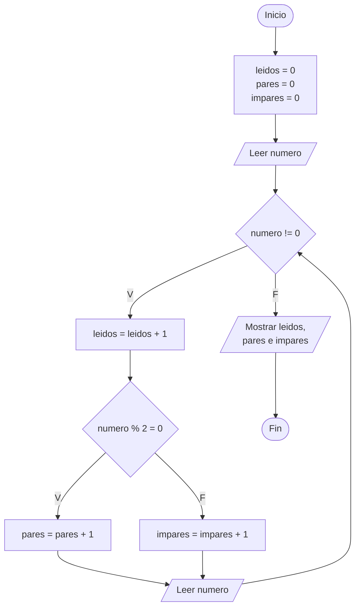
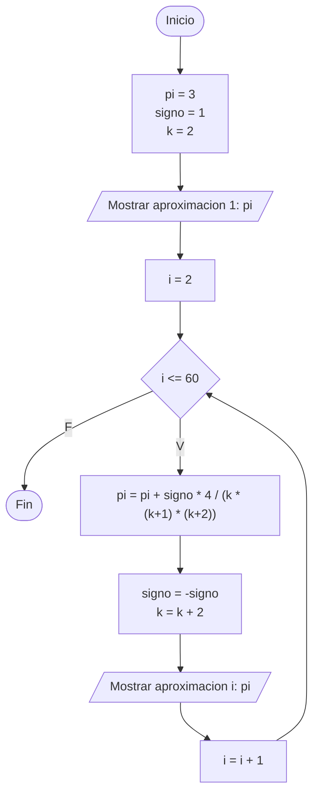
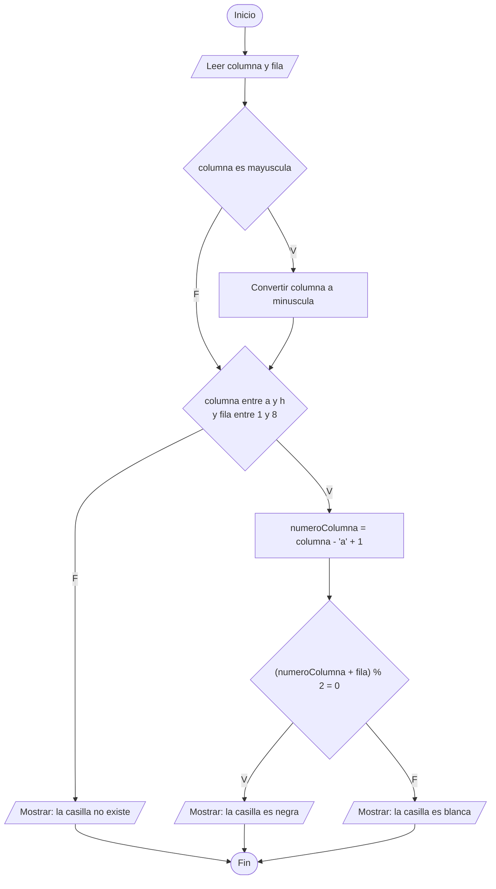

# Diagramas de flujo - Ejercicios propuestos de la Sesion 2A

Simbolos usados, los mismos de la Actividad 1 de la diapositiva:

| Forma | Significado |
| :--- | :--- |
| Ovalo | Inicio y Fin |
| Romboide | Entrada o salida de datos |
| Rectangulo | Proceso o asignacion |
| Rombo | Decision, con salidas V (verdadero) y F (falso) |

---

## Ejercicio 1 - Hasta cero

La flecha que vuelve de "Leer numero" hacia el rombo es la que forma el bucle.
El cero no se cuenta porque la decision se evalua antes de sumar al contador.

---

## Ejercicio 2 - Aproximando pi

Es un bucle de cantidad conocida, 60 vueltas, por eso se implementa con for.
La variable signo alterna entre +1 y -1 para que los terminos se sumen y resten.

---

## Ejercicio 3 - Casillas de ajedrez

Este ejercicio no tiene bucles: es una secuencia de decisiones.
La ultima, la de la paridad, es la que resuelve el problema.
