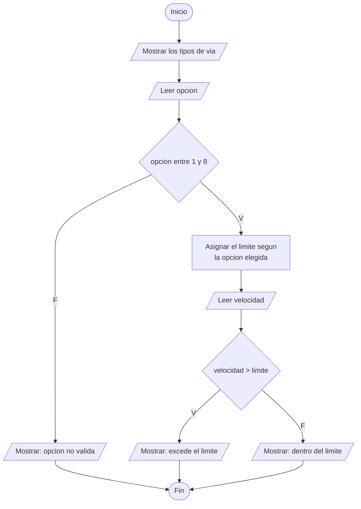
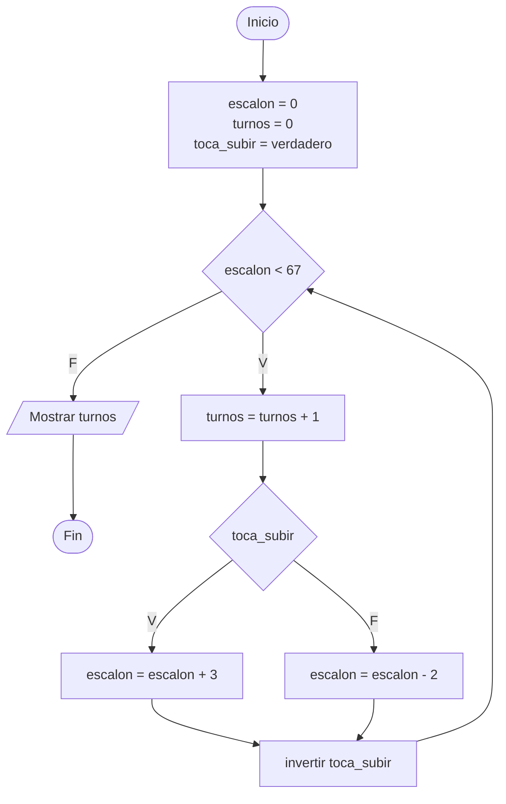
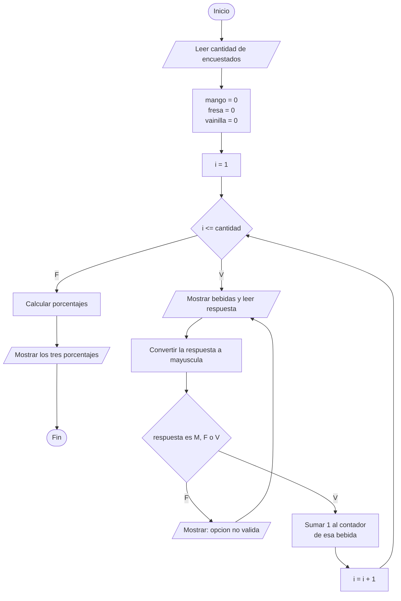
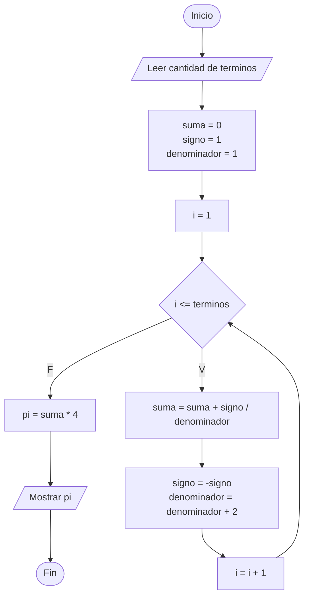

# Diagramas de flujo - Ejercicios propuestos de la Sesion 2B

Simbolos usados, los mismos de la Actividad 1 de la diapositiva A:

| Forma | Significado |
| :--- | :--- |
| Ovalo | Inicio y Fin |
| Romboide | Entrada o salida de datos |
| Rectangulo | Proceso o asignacion |
| Rombo | Decision, con salidas V (verdadero) y F (falso) |

---

## Ejercicio 1 - Control de velocidad

No lleva bucles: es una cadena de decisiones.
La asignacion del limite se resuelve con un switch de ocho casos.

---

## Ejercicio 2 - Escalones

Es un bucle de cantidad desconocida: no se sabe cuantos turnos hacen falta,
solo cuando parar. Por eso se usa while y no for.
Resultado: 129 turnos para llegar al escalon 67.

---

## Ejercicio 3 - Encuesta de una cafeteria

Hay dos bucles anidados: el for que recorre a los encuestados, y dentro,
el while que vuelve a preguntar mientras la letra no sea valida.

---

## Ejercicio 4 - Serie de Leibniz

Mismo esqueleto que el ejercicio de pi de la Sesion 2A: un bucle for con un
acumulador, una variable de signo que se invierte y un denominador que avanza.
La diferencia es que aqui la suma da pi/4, por eso al final se multiplica por 4.
